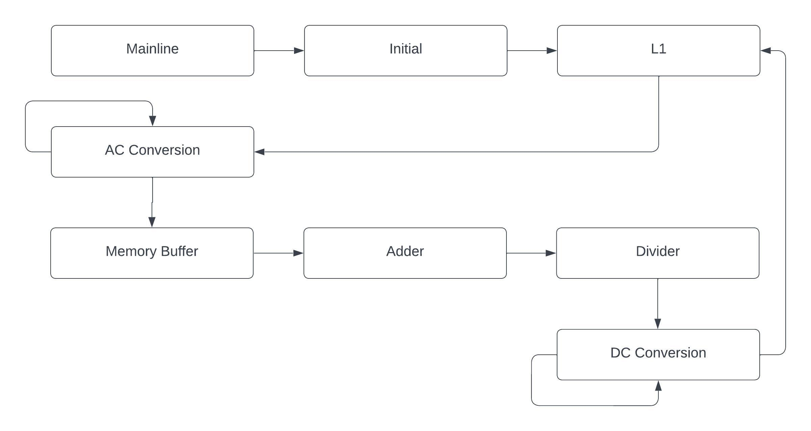
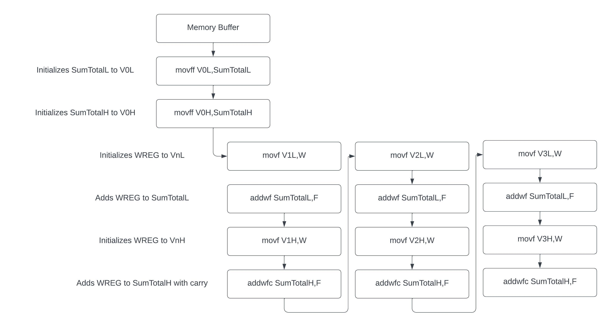
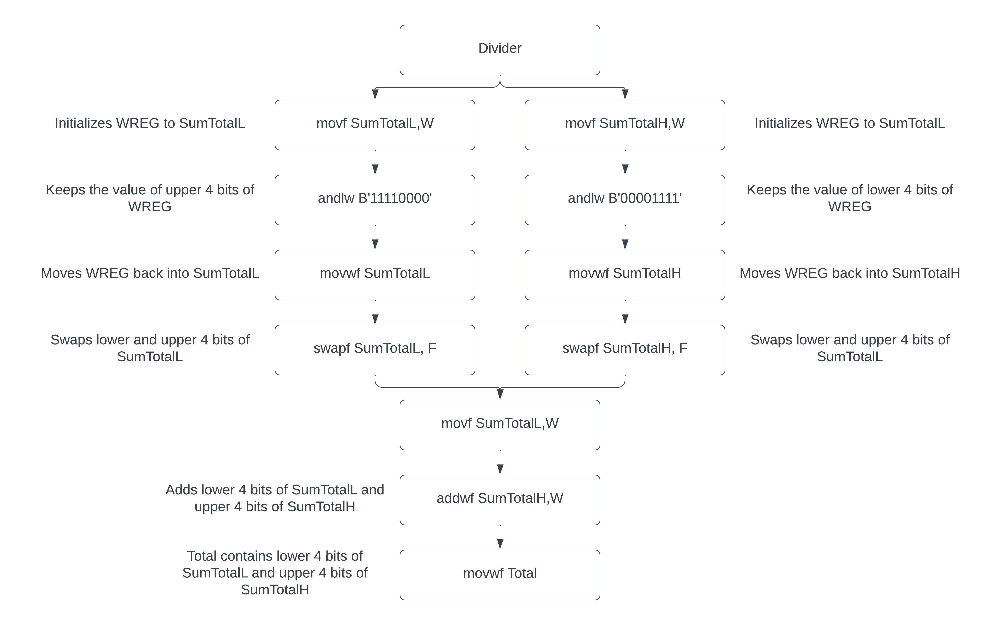
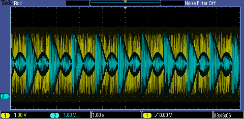
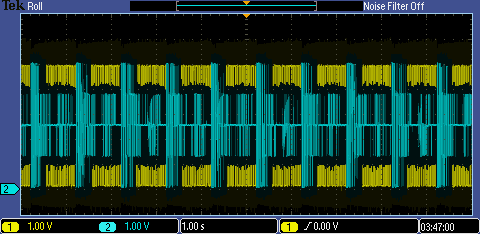
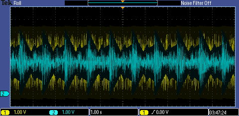

# Digital Signal Processing: FIR Filter Implementation

## Overview

This project implements a **Finite Impulse Response (FIR) Filter** using a PIC18F4520 microcontroller on a QwikFlash development board. The implementation demonstrates real-time digital signal processing capabilities with hardware-based filtering.

## System Architecture

The FIR filter implementation follows a structured approach with distinct processing blocks:

### Memory Buffer System

The system uses a shift register approach for sample storage, maintaining the four most recent input samples (V0, V1, V2, V3) required for the 4-tap FIR filter.

### Processing Stages

#### 1. Adder Stage

The adder stage performs the convolution sum, adding all four stored samples (V0 + V1 + V2 + V3) to implement the moving average filter.

#### 2. Divider Stage  

The divider stage scales the result by dividing by 4 using efficient bit manipulation techniques, avoiding costly division operations.

## Project Components

### 1. **Assembly Implementation** - [FIR_Filter.asm](FIR_Filter.asm)

The main implementation file containing:

- **Hardware Configuration**: 
  - PIC18F4520 microcontroller setup
  - HS oscillator configuration
  - ADC configuration for analog input sampling
  - SPI communication setup for DAC output

- **FIR Filter Algorithm**:
  - 4-tap FIR filter implementation
  - Coefficient values: [1, 1, 1, 1] (simple moving average filter)
  - Sample memory management (V0, V1, V2, V3 for current and previous samples)
  - Real-time convolution processing

- **Key Features**:
  - **ADC Sampling**: Channel 7 (AN7) input
  - **Memory Management**: Shift register implementation for sample history
  - **Mathematical Operations**: Addition and division by 4 (bit-shifting)
  - **DAC Output**: SPI-based digital-to-analog conversion

### 2. **MATLAB Analysis** - [FIR_Filter_FreqResp.m](FIR_Filter_FreqResp.m)

Frequency response analysis script that:

- **Sampling Parameters**:
  - Sampling frequency: 13 kHz
  - Filter coefficients: [1, 1, 1, 1]
  - Denominator coefficient: 4

- **Analysis Features**:
  - Generates frequency response plot
  - Displays magnitude vs. frequency characteristics
  - Provides visual verification of filter performance

## Filter Performance Analysis

### Frequency Response Characteristics
The filter demonstrates low-pass characteristics with the following test signals:

#### Input Signal Testing

**Sine Wave Response:**

**Square Wave Response:**

**Triangle Wave Response:**

**Ramp Signal Response:**

### Nyquist Frequency Analysis

The system operates at 13kHz sampling frequency, with proper consideration of Nyquist criteria for signal reconstruction.

## Technical Specifications

### Filter Characteristics
- **Type**: Low-pass FIR filter (4-tap)
- **Coefficients**: [1, 1, 1, 1]
- **Implementation**: Moving average filter
- **Cutoff Frequency**: Determined by coefficient design

### Hardware Requirements
- **Microcontroller**: PIC18F4520
- **Development Board**: QwikFlash
- **Input**: Analog signal on AN7
- **Output**: Digital-to-analog converter via SPI
- **Clock**: High-speed (HS) oscillator

### Software Requirements
- **Assembly**: MPLAB X IDE or similar PIC assembler
- **Analysis**: MATLAB/Octave for frequency response visualization

## Algorithm Flow

1. **Initialization**: Configure ADC, SPI, and I/O ports
2. **Sampling**: Read analog input via ADC channel 7
3. **Memory Update**: Shift previous samples (V3←V2←V1←V0←new_sample)
4. **Convolution**: Sum all four samples (V0 + V1 + V2 + V3)
5. **Scaling**: Divide by 4 using bit manipulation
6. **Output**: Send filtered result to DAC via SPI
7. **Loop**: Return to step 2 for continuous processing

## Mathematical Foundation

The implemented FIR filter follows the discrete convolution formula:

$$y[n] = \sum_{k=0}^{N-1} h[k] \cdot x[n-k]$$

Where:
- $y[n]$ = filtered output
- $h[k]$ = filter coefficients [1, 1, 1, 1]
- $x[n-k]$ = input samples
- $N$ = 4 (filter length)

For this implementation:
$$y[n] = \frac{1}{4}(x[n] + x[n-1] + x[n-2] + x[n-3])$$

## Usage Instructions

### Assembly Code Deployment
1. Open [FIR_Filter.asm](FIR_Filter.asm) in MPLAB X IDE
2. Build the project for PIC18F4520 target
3. Program the QwikFlash board
4. Connect analog input signal to AN7
5. Monitor filtered output via DAC

### MATLAB Analysis
1. Run [FIR_Filter_FreqResp.m](FIR_Filter_FreqResp.m) in MATLAB
2. View the frequency response plot
3. Analyze filter characteristics and cutoff frequency

## Features

- **Real-time Processing**: Continuous sampling and filtering
- **Memory Efficient**: Minimal RAM usage with optimized variable storage
- **Hardware Integration**: Direct ADC input and DAC output
- **Configurable**: Easy modification of filter coefficients
- **Visual Analysis**: MATLAB-based frequency response verification

## Applications

- Audio signal filtering
- Sensor data smoothing
- Noise reduction in analog measurements
- Educational demonstration of DSP concepts
- Embedded system signal conditioning

## Additional Resources

- **[Assembly Source Code](FIR_Filter.asm)**: Complete PIC18F4520 implementation
- **[MATLAB Analysis Script](FIR_Filter_FreqResp.m)**: Frequency response analysis tool

## Development Environment

- **Target**: PIC18F4520 microcontroller
- **IDE**: MPLAB X IDE
- **Language**: PIC Assembly Language
- **Analysis Tool**: MATLAB
- **Hardware**: QwikFlash development board

---

*This project demonstrates practical implementation of digital signal processing concepts using embedded microcontroller technology.*